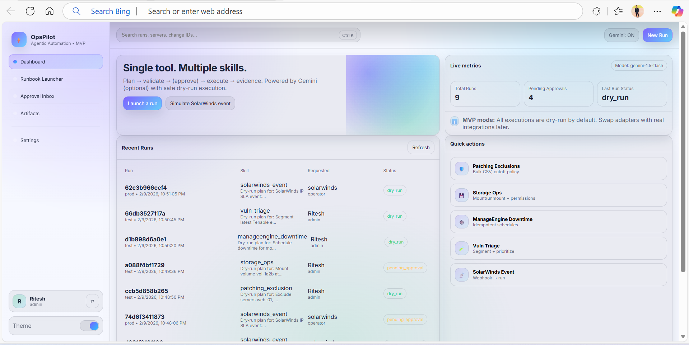

# 🚀 OpsPilot MVP — Single Agentic Automation Tool (5 Use Cases) + Gemini

A **single automation tool MVP** that delivers **five infrastructure operations use cases** through **one web UI + one FastAPI backend**.   
It follows an agentic workflow: **interpret → plan → policy gate → (approval if needed) → dry-run execute → evidence**. 

> ✅ This README is **ONLY** for the current OpsPilot MVP (5-use-case automation). It does **not** mix with any other tool concept. 

---

## ✨ What this MVP does

### ✅ Five supported use cases (single tool)

1. **Patching Exclusions** — submit patch exclusion requests (server list, window, reason, change id) and generate dry-run evidence.  
2. **Storage Ops** — mount/unmount/permissions workflow (simulated) with policy gate (prod actions typically require approval). 
3. **ManageEngine Downtime Scheduling** — create/update downtime schedules (simulated).  
4. **Vulnerability Triage** — upload a CSV; system counts rows, generates a plan, and produces triage evidence (simulated).
5. **SolarWinds IP SLA Event Automation** — receive a webhook payload, generate a plan, and produce event-handling evidence (simulated). 

### ✅ Governance behaviors included

- **Policy engine** sets risk and decides if **approval is required** (example: high-risk changes, prod storage ops). 
- **Approvals**: high-risk runs can be approved/rejected using the UI (admin role required for high-risk approvals).  
- **Evidence**: every executed run produces JSON evidence visible in the UI (Artifacts view). 

### ✅ Gemini integration (optional)

- If `GEMINI_API_KEY` is configured, Gemini is used as the planner. 
- If not configured, the system falls back to a deterministic stub plan (still fully functional). 

---

## 🧱 Architecture (MVP)

- **Frontend:** Vanilla **HTML/CSS/JS** UI served by FastAPI.
- **Backend:** **FastAPI** with endpoints for chat, runs, approvals, vulnerability upload, SolarWinds webhook. 
- **Execution mode:** **Dry-run** adapters only (safe for demo). 

---

## 📂 Repository Structure

```text
opspilot-mvp/
├── backend/
│   ├── app/
│   │   ├── main.py                 # API routes (chat/runs/approvals/webhooks/uploads)
│   │   └── core/
│   │       ├── config.py           # Settings (.env)
│   │       ├── llm_gemini.py       # Gemini planner (fallback supported)
│   │       ├── orchestrator.py     # plan → policy → execute
│   │       ├── policy.py           # risk/approval rules
│   │       ├── store.py            # MVP run storage
│   │       └── tools.py            # simulated adapters
│   ├── requirements.txt
│   └── Dockerfile
│
├── frontend/
│   ├── index.html                  # UI layout
│   └── assets/
│       ├── styles.css              # UI styles
│       └── app.js                  # UI logic (runs, approvals, switch user)
│
├── .env.example
├── docker-compose.yml
└── README.md
```

---

## 🛠️ Prerequisites

- Python **3.10+** recommended (3.11+ works well). 
- (Optional) Gemini API key for LLM planning.

---

## ⚙️ Configuration (.env)

Create a `.env` file at repo root:

### ✅ Gemini (optional)

```env
GEMINI_API_KEY=YOUR_GEMINI_KEY
GEMINI_MODEL=gemini-1.5-flash
```

If you keep `GEMINI_API_KEY` empty, planner will run in fallback (stub) mode.

---

## 🚀 Run Locally (Windows / macOS / Linux)

### 1) Go to project folder

```bash
cd opspilot-mvp
```

### 2) Create virtual environment

```bash
python -m venv .venv
```

### 3) Activate venv

**Windows PowerShell:**
```powershell
.\.venv\Scripts\Activate.ps1
```

**Windows CMD:**
```bat
.\.venv\Scripts\activate.bat
```

**macOS/Linux:**
```bash
source .venv/bin/activate
```

### 4) Install dependencies

```bash
pip install -r backend/requirements.txt
```

### 5) Run the server

```bash
uvicorn backend.app.main:app --reload --host 127.0.0.1 --port 8000
```

### 6) Open UI

- **UI:** http://localhost:8000/ 
- **API health:** http://localhost:8000/api/health 

### 📸 UI Dashboard Preview



---

## 🖥️ How to use the UI (Step-by-step)

### A) Switch User (Role Simulation)

This MVP uses a **Switch User** modal to simulate RBAC using request headers `X-User` and `X-Role`. 

1. Click **Switch User** (bottom-left card). 
2. Set:
   - `operator` for normal run creation
   - `admin` for approving high-risk runs
   - `viewer` for read-only viewing
3. Click **Save**.

> Tip: Use **admin** to approve high-risk operations. 

---

### B) Runbook Launcher (Create a run)

1. Go to **Runbook Launcher**.   
2. Choose a skill tab:
   - Patching / Storage / Downtime / Vuln / IP SLA 
3. Pick **Environment** (dev/test/prod). 
4. (Optional) Provide **Change ID**.
5. Enter a request (or click **Use example**).
6. Click **Generate plan**.

What happens next:
- The backend generates a plan (Gemini or stub). 
- Policy checks determine if approval is required. 
- If no approval needed, execution happens immediately in dry-run mode and evidence is stored. 

---

### C) Approval Inbox (Approve / Reject)

1. Navigate to **Approval Inbox**. 
2. You will see runs in `pending_approval` state.
3. Click **View**, then **Approve** or **Reject**.

High-risk approvals require `admin` role. 

---

### D) Artifacts (View evidence)

1. Open a run from Dashboard (Recent Runs) or from Approval Inbox.
2. Go to **Artifacts**.
3. Inspect:
   - Run metadata
   - Plan
   - Evidence JSON (adapter outputs)

Evidence is produced from dry-run adapters to keep the MVP safe. 

---

## 🧪 Test All 5 Use Cases (exact UI steps)

### ✅ Use Case 1 — Patching Exclusions

**Goal:** Create a patch exclusion request and produce evidence.

1. Switch user → `operator`
2. Runbook Launcher → select **Patching**
3. Environment: `dev` (or `prod` if you want stricter policy)
4. Enter request:

```text
Exclude servers web-01 and web-02 from Feb patch window. Reason: release freeze. CHG123456
```

5. Click **Generate plan**

Expected:
- Status becomes `dry_run` (or `pending_approval` if policy requires).

---

### ✅ Use Case 2 — Storage Ops (Approval flow demo)

**Goal:** Trigger approval requirement.

1. Switch user → `operator`
2. Runbook Launcher → select **Storage**
3. Set Environment = `prod`
4. Enter request:

```text
Unmount /data on app-prod-01. CHG789012
```

5. Click **Generate plan**

Expected:
- Status becomes `pending_approval`.

Approve:
1. Switch user → `admin`
2. Approval Inbox → Approve the run
3. Verify status becomes `dry_run` and evidence appears. 

---

### ✅ Use Case 3 — ManageEngine Downtime Scheduling

1. Switch user → `operator`
2. Runbook Launcher → select **Downtime**
3. Enter request:

```text
Schedule downtime for monitors PAYMENTS-API and PAYMENTS-DB from 01:00 to 03:00 IST. CHG123456
```

4. Click **Generate plan**

Expected:
- Evidence includes simulated schedule creation/update. 

---

### ✅ Use Case 4 — Vulnerability Triage (CSV Upload)

1. Runbook Launcher → select **Vuln**
2. Use the **Upload** section to upload a CSV file.
3. The backend counts rows and generates a triage plan and evidence. 

Expected:
- Evidence includes `{ filename, rows }` plus triage adapter output (dry-run). 

---

### ✅ Use Case 5 — SolarWinds IP SLA Event Automation

**Option A: UI Simulation**

1. Dashboard → click **Simulate SolarWinds event**.
2. A run will be created automatically.

**Option B: API call (recommended for testing)** 

```bash
curl -X POST http://localhost:8000/api/solarwinds/webhook \
  -H "Content-Type: application/json" \
  -d '{"site":"Pune-DC","device":"core-sw-01","state":"PRIMARY_DOWN"}'
```

Expected:
- Run is created and evidence includes the webhook payload. 

---

## 🔌 API Reference (current MVP)

- `GET  /api/health` — backend status and gemini configuration.
- `POST /api/chat` — create a run with plan + policy; executes immediately if no approval required. 
- `GET  /api/runs` — list all runs. 
- `GET  /api/runs/{run_id}` — get run details and evidence. 
- `POST /api/runs/{run_id}/approve` — approve/reject a pending run (admin for high risk).  
- `POST /api/solarwinds/webhook` — create a run from a SolarWinds IP SLA event payload.  
- `POST /api/vuln/upload` — upload CSV for vulnerability triage.

---

## 🔍 Troubleshooting

### 1) venv activation blocked (PowerShell)

```powershell
Set-ExecutionPolicy -Scope CurrentUser -ExecutionPolicy RemoteSigned
```

Then:

```powershell
.\.venv\Scripts\Activate.ps1
```

### 2) Wrong uvicorn module path

From repo root:

```bash
uvicorn backend.app.main:app --reload --port 8000
```

### 3) UI changes not reflected

Hard refresh:
- Windows/Chrome/Edge: **Ctrl + F5**

### 4) Approve does not work

Ensure:
- Switch User role is set to `admin` before approving high-risk runs. 

---

## 🔐 Production note

This MVP uses **simulated adapters** and is safe-by-default. To connect real environments, you must add:

- Secret management (Vault/KeyVault)
- Real tool integrations (ManageEngine, AWX/Ansible, SolarWinds, Tenable/Kenna)
- Strong RBAC/SSO and audit logs
- Allow-listed tool actions and command safety

---

## 👤 Author

**Ritesh Raut**  
*Programmer Analyst, Cognizant*

🤖 Smart Ops. Zero Risk. One Unified Automation Engine 🔧✨

---

### 🌐 Connect with me:
<p align="left">
<a href="https://github.com/Riteshraut0116" target="blank"></a>
<a href="https://linkedin.com/in/ritesh-raut-9aa4b71ba" target="blank"></a>
<a href="https://www.instagram.com/riteshraut1601/" target="blank"></a>
<a href="https://www.facebook.com/ritesh.raut.649321/" target="blank"></a>
</p>

---
